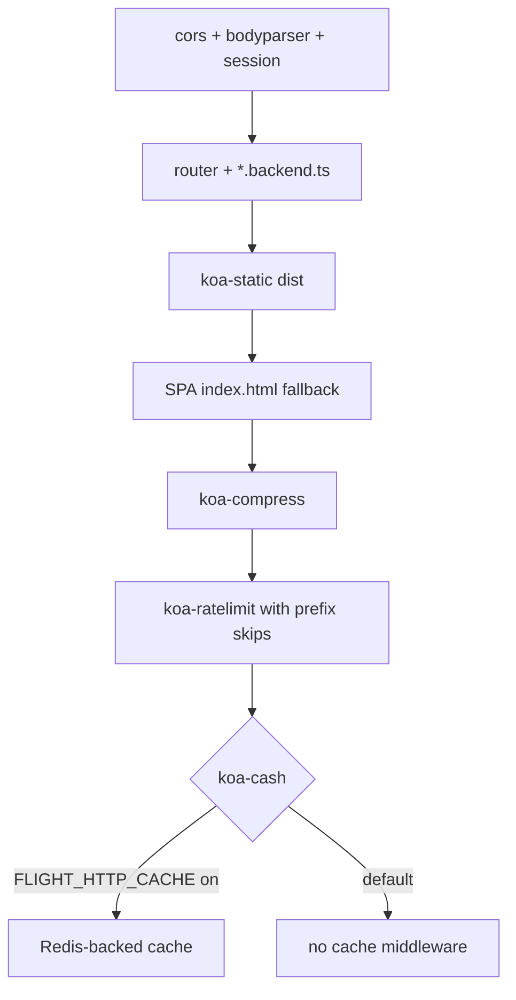

<p align="center">
  
</p>

# Flight

**Flight** is a Node.js application server for teams who want something **fast**, **boring in the good way**, and **ready for serious traffic**. You bring your own hosting—there is no lock-in to a proprietary edge or a single vendor’s deployment story. It fits **twelve-factor** style workflows: configuration via environment variables, horizontal scaling, and state kept where it belongs (for Flight, that includes **Redis** for sessions and cache-friendly layers).

Think **platform-agnostic**: not framework-as-a-platform, but a clear runtime you can run wherever Node runs—VMs, Kubernetes, bare metal, your cloud of choice. Flight is aimed at **hyperscale-friendly** designs (cluster workers out of the box), **ephemeral** processes, and **component-shaped** backends so routes stay colocated with the features they serve. **Vue** and **Vite** are first-class today; **React** support is on the roadmap.

Flight is **open source** from **[ThoughtPivot](https://github.com/thoughtpivot)**.

## Highlights

- **Performance-focused**: Cluster mode, compression, Redis-backed caching hooks, rate limiting in production
- **Developer velocity**: Vite-powered dev server with HMR for **Vue** (React roadmap)
- **Composable backends**: Discover `**/*.backend.ts` under your app root and mount Koa routes per component
- **Production SPA**: Built-in **`dist` + `index.html`** fallback (option B) when running **`production`** with **`disable_vite`**, with an explicit opt-out for API-only processes
- **Configurable discovery**: `--exclude_paths` / `FLIGHT_EXCLUDE_PATHS` to skip directories when scanning backends
- **TypeScript-native**: Written for TS projects; sensible defaults, minimal ceremony
- **Interop-friendly**: Correct handling of `yargs` when launched via **tsx** or similar loaders (no patch-package needed from **v1.0.8** onward)

## Installation

```bash
npm install @thoughtpivot/flight
# or
yarn add @thoughtpivot/flight
```

Legacy npm scope: the package was previously published as `@spytech/flight`—use `@thoughtpivot/flight` going forward.

### Downstream apps (tsx)

From **v1.0.8** onward, Flight normalizes `require('yargs/yargs')` under loaders that expose `{ default: factory }`. If you added **patch-package** only for that issue, upgrade Flight and drop that patch.

## Quick Start

1. Create a new project directory and initialize:

```bash
mkdir my-flight-app
cd my-flight-app
npm init -y
```

2. Install Flight and its dependencies:

```bash
npm install @thoughtpivot/flight ioredis
```

3. Ensure Redis is running locally or set environment variables (see table below).

4. Create a component with a backend route:

```bash
mkdir -p components/hello
```

Create `components/hello/hello.backend.ts`:

```typescript
import Router from '@koa/router'

const router = new Router()

router.get('/hello', async (ctx) => {
    ctx.body = { message: 'Hello from Flight!' }
})

export default router.routes()
```

5. Start the server:

**Development mode:**

```bash
node flight.js --mode development --app_home .
# Vite dev server on port 3001 with HMR; backend API on port 3000
```

**Production mode:**

```bash
node flight.js --mode production --app_home .
# Production bundle + server on port 3000 (see env table for ports/paths)
```

## Development vs production

Flight picks **`mode`** as: **`FLIGHT_MODE`** (if set and non-empty), else **`--mode`** from argv, else **`production`**. Everything below assumes Redis is reachable unless you only use routes that avoid session/ratelimit/cache.

| Topic            | Development                                                                                   | Production                                                                                                                                  |
| ---------------- | --------------------------------------------------------------------------------------------- | ------------------------------------------------------------------------------------------------------------------------------------------- |
| **Vite**         | Child process: `npx vite --port 3001 --host 0.0.0.0` (HMR).                                   | If **`disable_vite` is false**: `exec('npx vite build')` is triggered once at worker startup. If **`disable_vite` is true**: no Vite build. |
| **Listen port**  | API + sessions on **`--port`** / `FLIGHT_PORT` (default **3000**). UI dev server on **3001**. | Same **`--port`** / `FLIGHT_PORT` for the worker.                                                                                           |
| **Static / SPA** | The Vite dev server serves UI; Flight does **not** mount the production static/SPA stack.     | See **Production SPA pipeline** below: when **`production`** + **`disable_vite`**, Flight uses **Option A** by default unless opted out.    |
| **Typical use**  | Local full-stack with HMR.                                                                    | CI-built `dist` served by Flight (or behind a load balancer).                                                                               |

**Edge cases**

- **`production` + `disable_vite` false**: Vite build still runs; **legacy** middleware order applies (`compress` → `ratelimit` → `koa-cash` → static), because built-assets-only mode is off.
- **`production` + `disable_vite` true + `FLIGHT_DISABLE_SPA_PIPELINE`**: **Legacy** stack only—no SPA HTML fallback for unknown GETs; tail `koa-static` only after compress/ratelimit/cache.
- **`development`**: unchanged—Redis session store and production-only static/SPA branches do not apply the SPA pipeline section (the dev Vite server owns UI URLs).

## Configuration: CLI, `.env`, and environment variables

Flight loads a **`.env`** file from the **current working directory** at startup (via **`dotenv`**). Use **`FLIGHT_*`** in real deployments.

**Precedence**

- **`mode`**: **`FLIGHT_MODE`** wins over **`--mode`** when the variable is set (non-empty).
- **`disable_vite`**: explicit CLI wins; if omitted, **`FLIGHT_DISABLE_VITE`** (`true` / `1` / `yes` → on); otherwise **`false`**.
- Other settings: argv value if your launcher passes it, else the **`FLIGHT_*`** column, then default.

**Registered CLI options:** Flight registers **`--exclude_paths`**, **`--mode`**, **`--port`**, **`--app_home`**, **`--app_key`**, **`--app_secret`**, **`--payload_limit`**, and **`--disable_vite`** (with kebab-case aliases where listed in `--help`). yargs is not in **strict** mode, so additional flags may still appear on argv if you extend the entrypoint.

| Setting (CLI / argv)                 | Environment variable                 | Default          | Use case                                                                                                                                                                                                        |
| ------------------------------------ | ------------------------------------ | ---------------- | --------------------------------------------------------------------------------------------------------------------------------------------------------------------------------------------------------------- |
| `--exclude_paths`, `--exclude-paths` | `FLIGHT_EXCLUDE_PATHS`               | _(empty)_        | Skip subtrees when globbing `**/*.backend.ts` (monorepo vendor trees, fixtures).                                                                                                                                |
| `--app_home`                         | `FLIGHT_APP_HOME`                    | `.`              | Repository root; `process.chdir` target before discovery and static paths.                                                                                                                                      |
| `--app_key`                          | `FLIGHT_APP_KEY`                     | `flightApp`      | Session cookie name.                                                                                                                                                                                            |
| `--app_secret`                       | `FLIGHT_APP_SECRET`                  | _(see code)_     | Cookie signing secret(s); comma-separated for key rotation.                                                                                                                                                     |
| _(argv)_                             | `FLIGHT_SESSION_DURATION_MS`         | `86400000`       | Session `maxAge` in ms.                                                                                                                                                                                         |
| `--port`                             | `FLIGHT_PORT`                        | `3000`           | HTTP listen port (all modes).                                                                                                                                                                                   |
| `--payload_limit`                    | `FLIGHT_PAYLOAD_LIMIT`               | `1mb`            | `koa-bodyparser` JSON limit.                                                                                                                                                                                    |
| `--disable_vite`                     | `FLIGHT_DISABLE_VITE`                | `false`          | **`true` / `1` / `yes`**: skip `vite build` and treat the process as **built-assets** mode (triggers SPA pipeline rules in production).                                                                         |
| `--mode`                             | `FLIGHT_MODE`                        | `production`     | `development` spawns Vite; `production` enables production middleware.                                                                                                                                          |
| _(n/a)_                              | `FLIGHT_DIST_PATH`                   | `../dist`        | Filesystem root for `koa-static` (relative to cwd **after** chdir to `app_home`).                                                                                                                               |
| _(n/a)_                              | `FLIGHT_DISABLE_SPA_PIPELINE`        | _(unset)_        | **`1` / `true` / `yes`**: force **legacy** production stack (no in-router SPA fallback) while keeping `production` + `disable_vite`. Use for **API-only** workers or until duplicate app middleware is removed. |
| _(n/a)_                              | `FLIGHT_STATIC_PREFIXES`             | `/assets,/fonts` | Baseline URL prefixes for **rate-limit skipping** on `GET`/`HEAD` (static hashed chunks).                                                                                                                       |
| _(n/a)_                              | `FLIGHT_RATE_LIMIT_EXCLUDE_PREFIXES` | _(empty)_        | Extra prefixes merged with `FLIGHT_STATIC_PREFIXES` for the same skip list.                                                                                                                                     |
| _(n/a)_                              | `FLIGHT_SPA_INDEX`                   | `index.html`     | SPA shell file inside the dist root for HTML fallback.                                                                                                                                                          |
| _(n/a)_                              | `FLIGHT_SPA_DENY_PREFIXES`           | _(empty)_        | Extra prefixes that never get SPA fallback (merged with `/api`, `/health`).                                                                                                                                     |
| _(n/a)_                              | `FLIGHT_TRUST_PROXY`                 | `false`          | **`1` / `true` / `yes`**: set **`app.proxy = true`** so `ctx.ip` / rate-limit id use **`X-Forwarded-For`** behind an L7 LB.                                                                                     |
| _(n/a)_                              | `FLIGHT_HTTP_CACHE`                  | `false`          | **`1` / `true` / `yes`**: enable **`koa-cash`** in the **SPA pipeline** branch only (off by default there). Legacy branch always attaches `koa-cash`.                                                           |
| _(n/a)_                              | `FLIGHT_REDIS_HOST`                  | `localhost`      | Redis for sessions, rate limit, and cache adapter.                                                                                                                                                              |
| _(n/a)_                              | `FLIGHT_REDIS_PORT`                  | `6379`           | Redis port.                                                                                                                                                                                                     |
| _(n/a)_                              | `FLIGHT_MAX_WORKERS`                 | CPU count        | Cap cluster worker count on small nodes.                                                                                                                                                                        |

Example `.env` fragment:

```bash
FLIGHT_MODE=development
FLIGHT_APP_HOME=.
FLIGHT_REDIS_HOST=127.0.0.1
FLIGHT_REDIS_PORT=6379
FLIGHT_PORT=3000
FLIGHT_MAX_WORKERS=4
```

Production behind a proxy:

```bash
FLIGHT_MODE=production
FLIGHT_DISABLE_VITE=true
FLIGHT_TRUST_PROXY=1
```

## Project Structure

```
my-app/
├── components/
│   └── Hello/
│       ├── Hello.vue          # Vue UI (example)
│       └── Hello.backend.ts   # Koa routes for this component
├── assets/
├── dist/                      # Production build output
└── package.json
```

Example Vue + backend snippets:

`components/hello/Index.vue`:

```vue
<template>
    <div>
        <h1>{{ message }}</h1>
    </div>
</template>

<script setup lang="ts">
import { ref } from 'vue'

const message = ref('Hello from Flight!')
</script>
```

`components/hello/Index.backend.ts`:

```typescript
import Router from '@koa/router'

const router = new Router()

router.get('/hello', async (ctx) => {
    ctx.body = { message: 'Hello from Flight!' }
})

export default router.routes()
```

## Development mode

- **Vue** + **Vite** with HMR on port **3001**
- Backend worker on **`--port`** (default **3000**)
- Request logging via **`koa-logger`**

## Production mode

- Optional **`npx vite build`** before serving static assets when **`disable_vite`** is **false**
- Cluster workers capped by **`FLIGHT_MAX_WORKERS`**
- Compression + Redis-backed rate limiting in all production configurations
- Static dist + SPA behavior depends on **built-assets mode**—see next section

## Production SPA pipeline (v2)

**When it is on (option B):** `mode === 'production'` **and** **`disable_vite === true`** **and** **`FLIGHT_DISABLE_SPA_PIPELINE` is not truthy.**

**What it does:** After your **`router`** (all `**/*.backend.ts` routes), Flight serves **`FLIGHT_DIST_PATH`** with **`koa-static`**, then applies an **`index.html`** fallback for typical browser navigations (see tests in `src/spa-pipeline.test.ts` for the behavioral contract). Only then runs **`koa-compress`**, Redis **`koa-ratelimit`** (with **`GET`/`HEAD` skipped** under `FLIGHT_STATIC_PREFIXES` ∪ `FLIGHT_RATE_LIMIT_EXCLUDE_PREFIXES`), and optionally **`koa-cash`** when **`FLIGHT_HTTP_CACHE`** is enabled.

**Path ownership**

- **API / BFF:** Implement on your `Router` in `*.backend.ts` under prefixes you own (conventionally **`/api/...`**). Those paths are excluded from the SPA fallback, along with **`/health`** and any **`FLIGHT_SPA_DENY_PREFIXES`**.
- **Static:** Any file present under the dist root is served by **`koa-static`** first.
- **SPA:** Remaining **`GET`/`HEAD`** requests that look like document navigations and whose last path segment has **no dot** (so `file.ext` URLs are not rewritten) may receive **`FLIGHT_SPA_INDEX`**.

**Load balancers and `X-Forwarded-For`**

- Set **`FLIGHT_TRUST_PROXY=1`** when Flight sits behind a trusted reverse proxy so **`ctx.ip`** and the rate limiter’s **`id`** reflect the client. Configure your proxy to append **one** well-formed **`X-Forwarded-For`** chain.
- Sessions use cookies (`sameSite: true` in code today); sticky sessions or shared Redis are operational choices outside Flight’s defaults.

### Middleware order (mermaid)

**SPA pipeline (default when production + `disable_vite`):**



**Legacy production stack** (`disable_vite` false, or **`FLIGHT_DISABLE_SPA_PIPELINE`** set): `router` → **`compress`** → **`ratelimit`** → **`koa-cash`** → **`koa-static`**.

### Migrating from Flight 1.x

1. If you rely on the **old** order (everything after `router` saw compress/ratelimit/cache **before** static), set **`FLIGHT_DISABLE_SPA_PIPELINE=1`** until you validate the new behavior.
2. If your app already shipped **custom SPA / history fallback** middleware in `*.backend.ts`, remove the duplicate once you confirm Flight’s fallback matches your routes (especially non-`/api` prefixes—use **`FLIGHT_SPA_DENY_PREFIXES`**).
3. Expect **`koa-cash` off** in the SPA pipeline unless you opt in with **`FLIGHT_HTTP_CACHE`**.

See **[CHANGELOG.md](CHANGELOG.md)** for the full **2.0.0** notes.

## Requirements

- Node.js **16.x** or higher
- **Redis** (sessions / rate limit / cache integrations)
- **TypeScript** in your app if you author `.backend.ts` modules as TS

## License

MIT

## Contributing

Issues and pull requests are welcome. Flight improves fastest with real workloads—if you hit an edge case, open an issue with a minimal repro.

## Acknowledgments

**Flight** succeeds **[Avian](https://github.com/ispyhumanfly/avian)**—the component-oriented Node server that helped prove this programming model. **Dan Stevenson** created Avian and carried it into **FlyPaper Technologies**, where **Nick Fredericks**, Dan, and the FlyPaper team sharpened Avian’s component boundaries and pushed its operational story. Dan continued to maintain Avian while **Flight** took shape to embrace newer tooling and a cleaner baseline for the next decade.

Today **Flight** is maintained by the **ThoughtPivot** engineering team and **contributors like you**—the same spirit of openness and iteration, with a hard focus on speed, clarity, and deployment flexibility.
